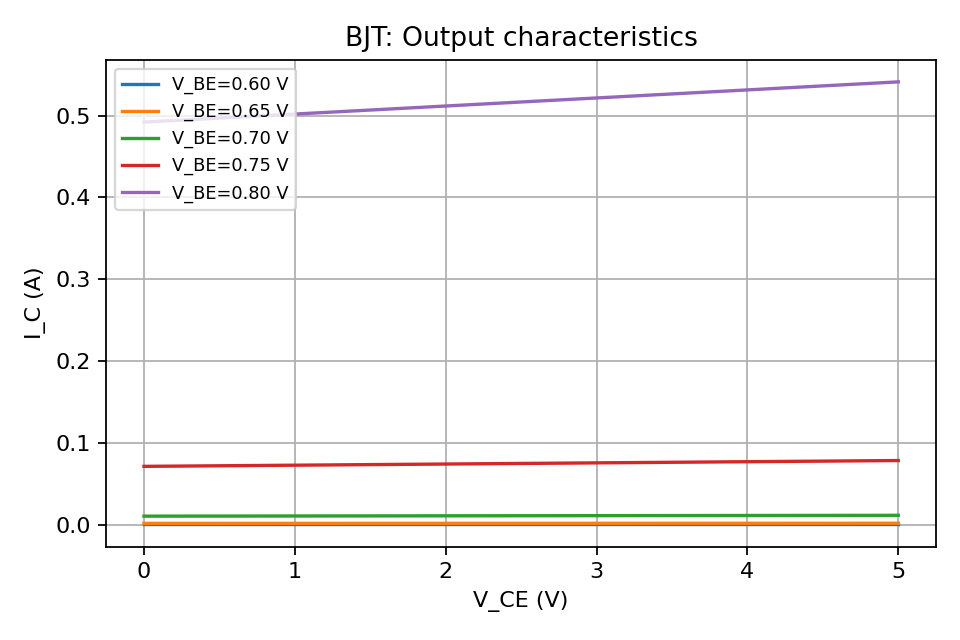
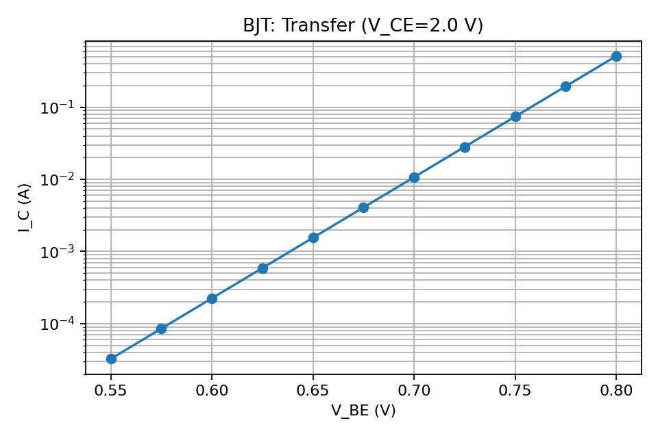

## BJT (Bipolar Junction Transistor)

A teaching-simple NPN BJT model using the Ebers–Moll forward-active expression with Early effect:

I_C(V_CE, V_BE) = I_S · exp(V_BE / V_T) · (1 + V_CE / V_A)

The model assumes forward-active operation and computes a grid of output characteristics across a sweep of V_CE for multiple V_BE values.

### Example

```python
import numpy as np
from semiconductor_sim.devices import BJT

bjt = BJT(doping_p=1e16, doping_n=1e18, early_voltage=50.0, vbe_values=[0.6, 0.65, 0.7, 0.75, 0.8])
vce = np.linspace(0.0, 5.0, 200)
ic_grid, = bjt.iv_characteristic(vce)
```

### Plots





### PNP Variant

For complementary PNP behavior for teaching symmetry, use `PNP`:

```python
from semiconductor_sim.devices import PNP
import numpy as np

pnp = PNP(
    doping_p=1e18,
    doping_n=1e16,
    early_voltage=50.0,
    veb_values=[0.6, 0.65, 0.7],
)
vce = np.linspace(-5.0, 0.0, 101)
ic_grid, = pnp.iv_characteristic(vce)  # negative currents for forward operation
```
