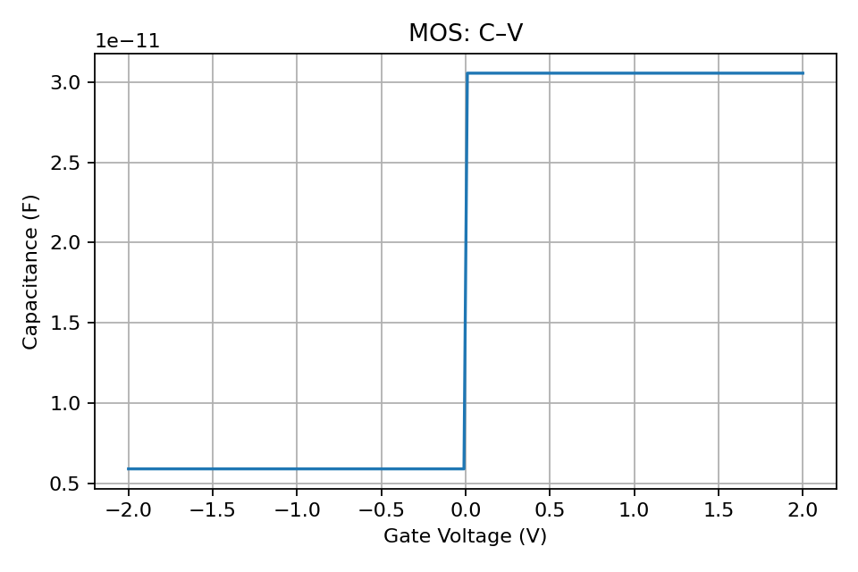

# Devices Overview

Explore the built-in device models and how materials affect their behavior.

- PN Junction: [docs](pn_junction.md)

  

- LED: [docs](led.md)

  

- Solar Cell: [docs](solar_cell.md)

  

- MOS Capacitor: [docs](mos_capacitor.md)

  

- Varactor Diode: [docs](varactor_diode.md)

  

- Tunnel Diode: [docs](tunnel_diode.md)

  

- Zener Diode: [docs](zener_diode.md)

  
