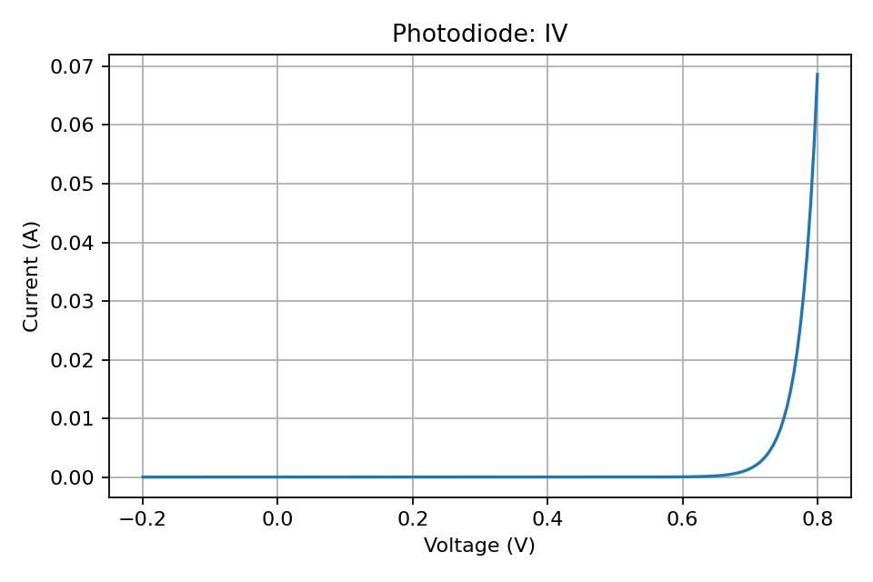

# Photodiode

Simple illuminated diode model: I(V) = -I_ph + I_s (e^{V/V_T} - 1).

## Usage

```python
from semiconductor_sim import Photodiode
import numpy as np

d = Photodiode(1e17, 1e17, irradiance_W_per_cm2=1e-3, responsivity_A_per_W=0.5)
v = np.linspace(-0.2, 0.8, 200)
(I,) = d.iv_characteristic(v)
```

## Plot



## Notes

- Photocurrent is proportional to irradiance and area via responsivity.
- Dark saturation current follows the same teaching-simple form as PN junction.
