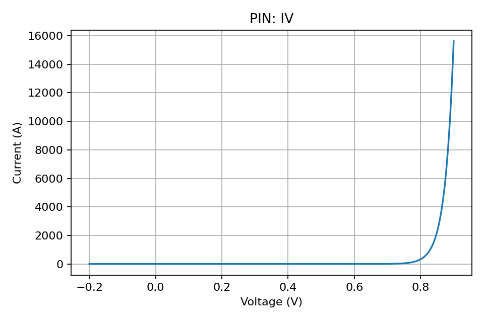

## PIN Diode

The PIN diode extends the PN junction by introducing an intrinsic (undoped) region
between the p- and n-type regions. This increases depletion width and supports fast
switching and RF applications.

### Model

- Ideal diode equation with an effective saturation current combining:
  - Edge diffusion current (PN-like)
  - SRH generation current in the intrinsic region
- Optional series resistance models ohmic drop.

This simple, teaching-focused model does not include conductivity modulation,
high-level injection, or dynamic charge storage.

### Example

```python
from semiconductor_sim import PINDiode
import numpy as np

diode = PINDiode(1e17, 1e17, intrinsic_width_cm=1e-4)
v = np.linspace(-0.2, 0.9, 200)
(i,) = diode.iv_characteristic(v)
```


