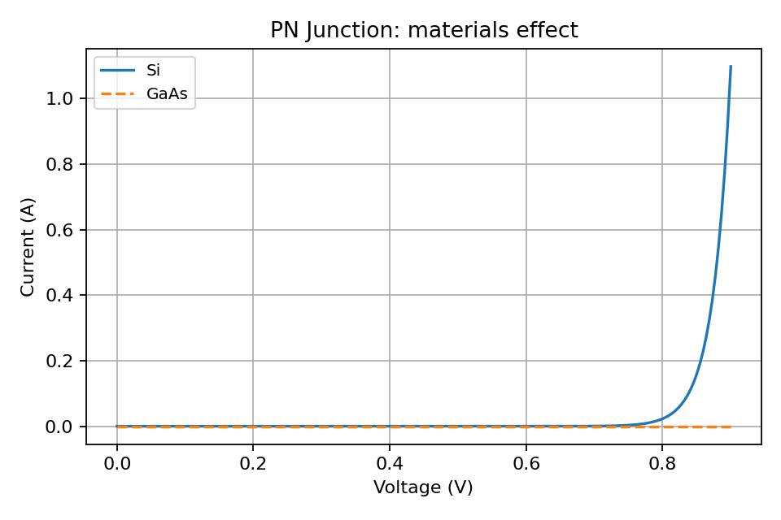

# PN Junction

- Overview: Classical PN diode using ideal diode equation.
  Optional SRH recombination and optional `material` support.

## Usage

```python
from semiconductor_sim import PNJunctionDiode
from semiconductor_sim.materials import get_material

si = get_material("Si")
d = PNJunctionDiode(1e17, 1e17, material=si)
```

## Materials

- Passing a `Material` adjusts `n_i(T)` which changes `I_s` and the I–V.



### See also

- Examples: [materials plotting](../examples.md#plotting-based-materials-comparison)
- Gallery: [PN materials](../gallery.md#materials-effects)
