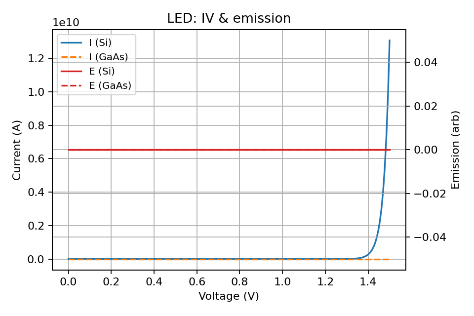

# Examples

Scripts: browse the `examples/` folder for CLI-friendly runs.
Notebooks: interactive versions use ipywidgets and Plotly for exploration.

For a GUI demo with tabs, see Interactivity. Launch:

```powershell
python -m streamlit run examples/app_interactive.py
```

Quick LED sample:

```python
import numpy as np
from semiconductor_sim.devices import LED

led = LED(doping_p=1e17, doping_n=1e17, temperature=300)
V = np.linspace(0, 2, 5)
current, emission = led.iv_characteristic(V)
```

## Thumbnail Gallery

- LED materials comparison (Si vs GaAs)

	[](devices/led.md)

- Solar cell IV (materials effect)

	[](devices/solar_cell.md)

- PN diode IV (materials effect)

	[](devices/pn_junction.md)

## Materials usage examples

List and fetch materials, and pass into devices to affect temperature-dependent
quantities like dark saturation current and open-circuit voltage.

```python
from semiconductor_sim.materials import list_materials, get_material
from semiconductor_sim.devices import LED, SolarCell, PNJunctionDiode

print(list(list_materials()))  # ['Si', 'Ge', 'GaAs']
si = get_material('Si')

diode = PNJunctionDiode(1e17, 1e17, material=si)
led = LED(1e17, 1e17, efficiency=0.2, material=si)
sc = SolarCell(1e17, 1e17, light_intensity=1.0, material=si)
```

### Plotting-based materials comparison

Run an example that compares Si vs GaAs for LED and SolarCell.

```powershell
python examples/example_materials_effects_plot.py
```

For a simple CLI, without plots, use:

```powershell
python examples/example_materials_effects.py
```
