# Gallery

Promoted outputs from examples and scripts. Images are automatically
regenerated in CI during the docs workflow. To regenerate locally, run:

```bash
python scripts/generate_gallery_images.py
```

## Materials Effects

- PN Junction

  [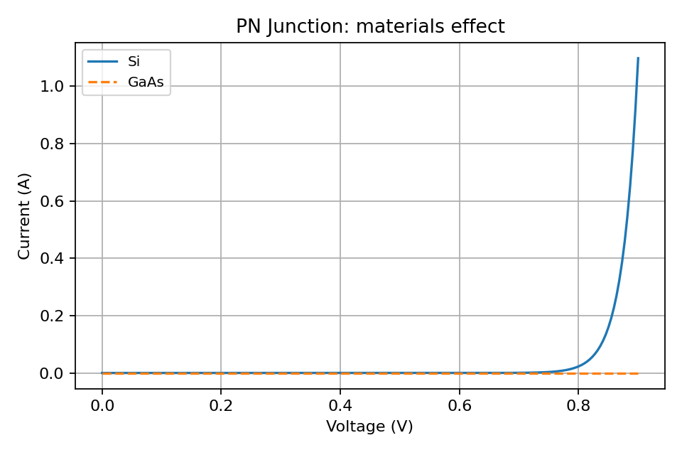](devices/pn_junction.md)

- LED

  [](devices/led.md)

- Solar Cell

  [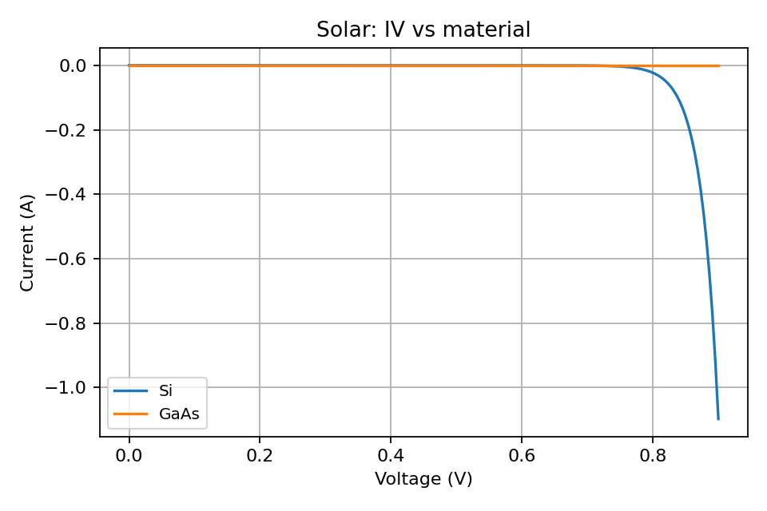](devices/solar_cell.md)

## Other Devices

- MOS Capacitor

  [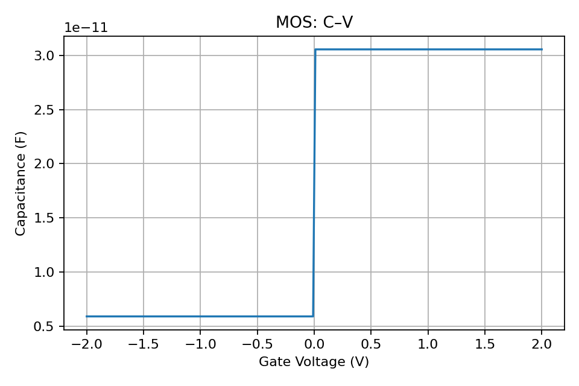](devices/mos_capacitor.md)

- Varactor Diode

  [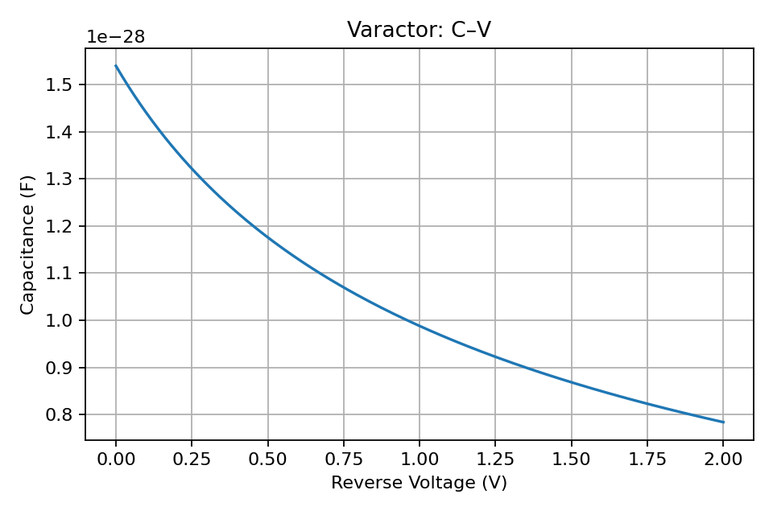](devices/varactor_diode.md)

- Tunnel Diode

  [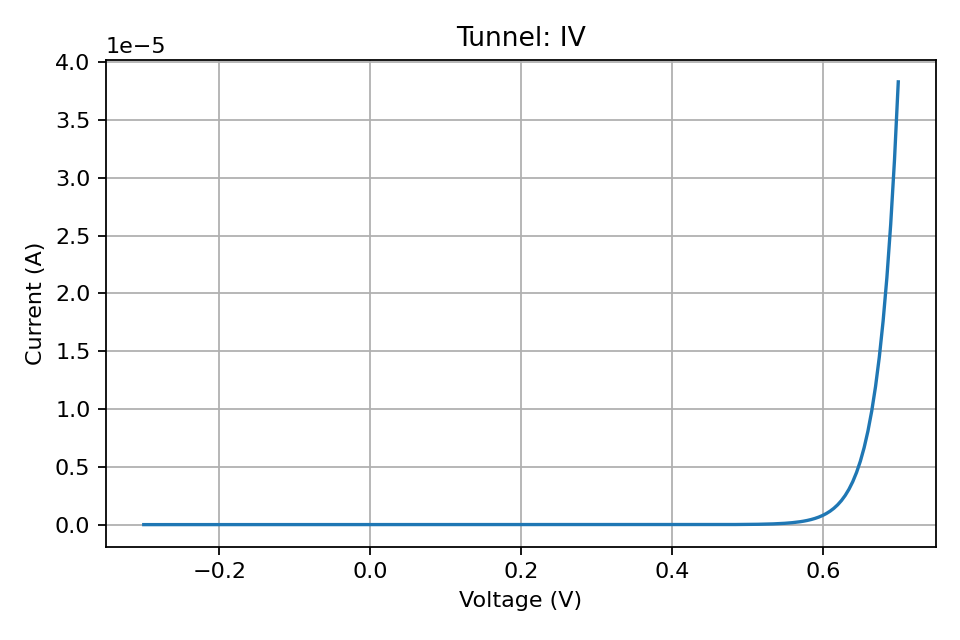](devices/tunnel_diode.md)

- Zener Diode

  [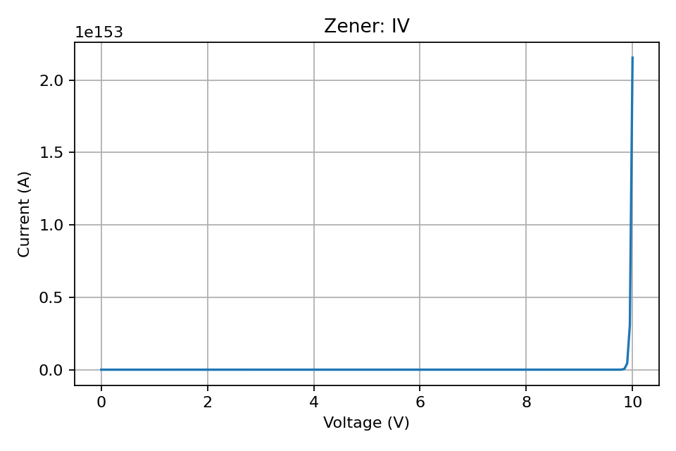](devices/zener_diode.md)

- PIN Diode

  [](devices/pin_diode.md)

- Photodiode

  [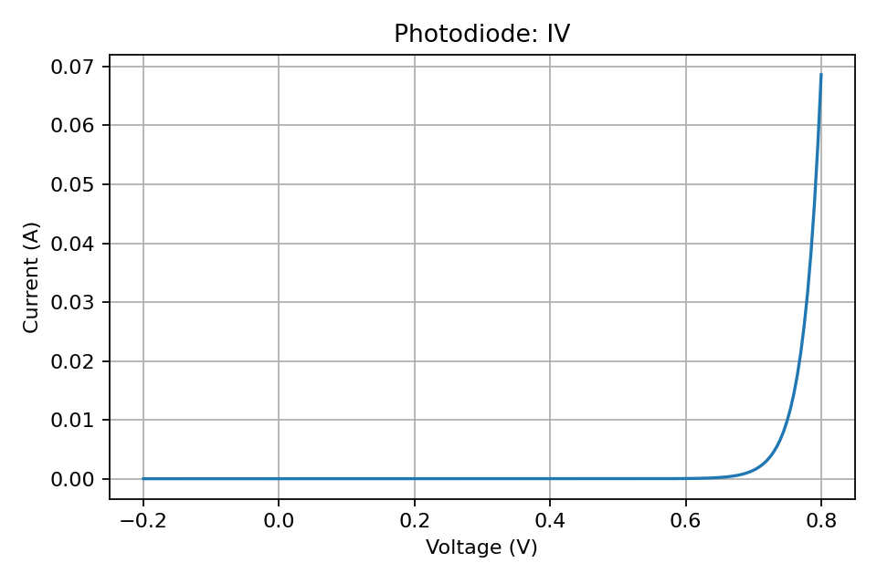](devices/photodiode.md)

- Schottky Diode

  [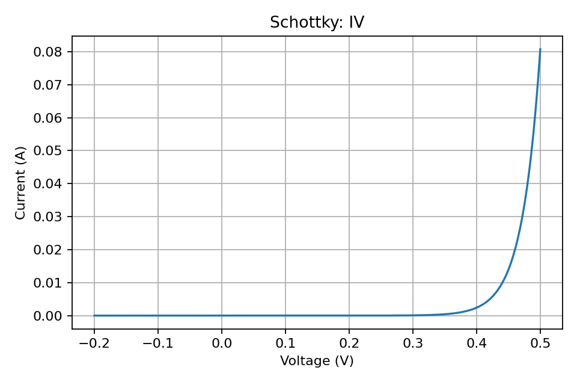](devices/schottky_diode.md)

- Schottky Diode (Series Resistance)

  [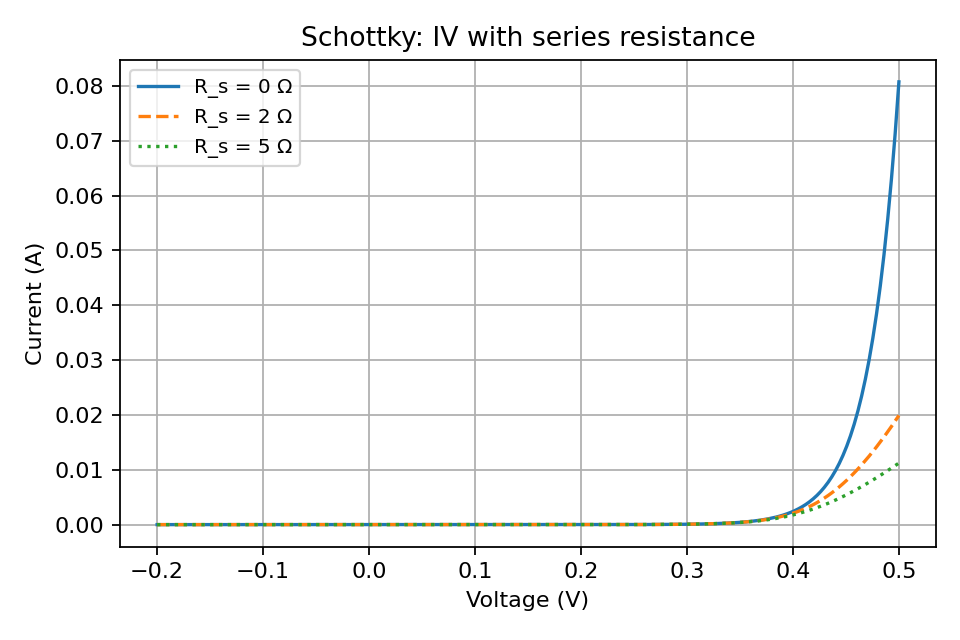](devices/schottky_diode.md)

- BJT (Transfer)

  [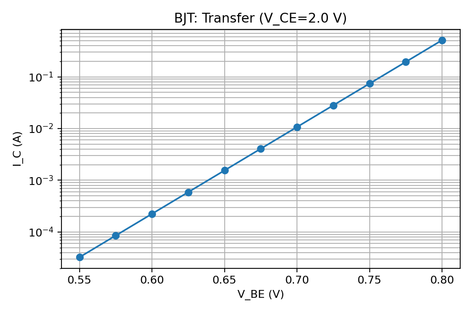](devices/bjt.md)

- BJT

  [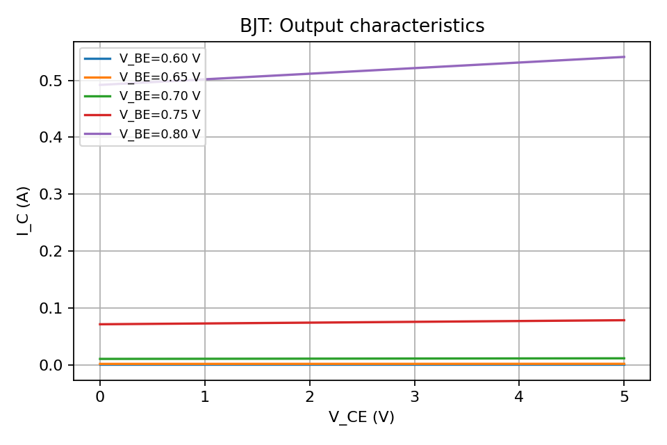](devices/bjt.md)

See the `examples/` folder for ready-to-run scripts and more.
